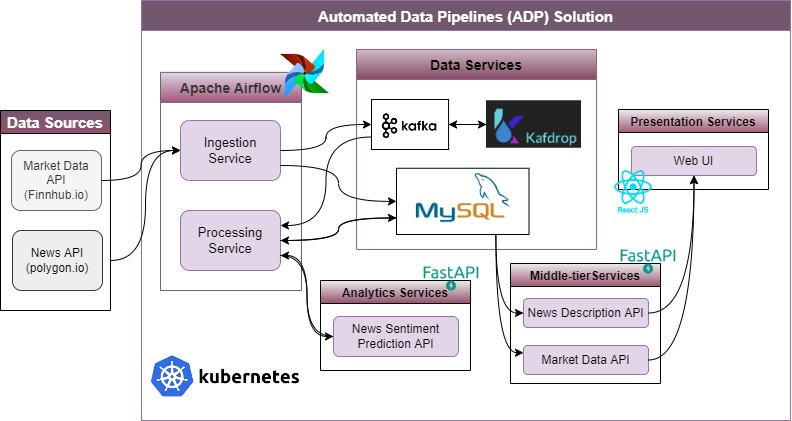

# Automated Data Pipelines (ADP) Solution 
This repository contains the source code for Automated Data Pipelines boosterpack, developed in collaboration with [Canarie](https://www.canarie.ca/) organization. This solution demonstrates how we at [Intelius Analytics](https://www.intelius.ai) used tools and technologies such as Kubernetes, Apache Airflow, MySQL, FastAPI, Apache Kafka and React.js to solve the problem of developing an integrated framework from open-source libraries for creating automated data pipelines. \
For more information about this solution including how to deploy it, refer to the boosterpack documentation on the Canarie website (link to be provided after publishing the boosterpack) \
Also, you can refer to ReadMe files in each of the folder in this repository to learn more about the applications or tools used in this solution. 

## Architecture 

> **Note**: Guiding Principles 
> 1. A microservice has a single concern.
> 2. A microservice is discrete.
> 3. A microservice is transportable.
> 4. A microservice carries its own data.
> 5. A microservice is ephemeral

## Core Services: 

1. [Analytical Services - News Sentiment](./news-sentiment/README.md)
2. Data Services
   - [MySQL](./mysql/helm/README.md)
   - [Kafka](./kafka/README.md)
   - [Kafka Drop](./kafdrop/README.md)
3. [Middle-tier Servies](./middle-tier/README.md)
4. [Presentation](./frontend/README.md)
5. [Airflow Services](./airflow/README.md)

[Security Policy](./SECURITY.md)

## License
All code and configuration in this package are licensed under the [Apache 2.0 License](LICENSE). Please also refer to the licensing terms of each of the tools used in this package, such as [Apache Airflow license](https://airflow.apache.org/docs/apache-airflow/stable/license.html), [Apache Kafka License](https://github.com/apache/kafka/blob/trunk/LICENSE), and [Bitnami’s MySQL helm chart license](https://artifacthub.io/packages/helm/bitnami/mysql#license). 
